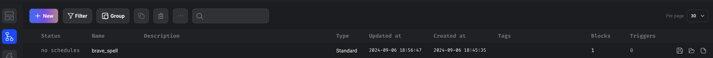
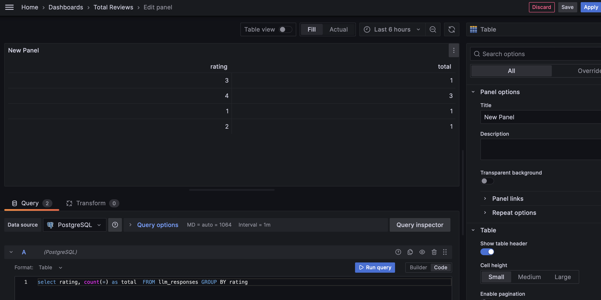
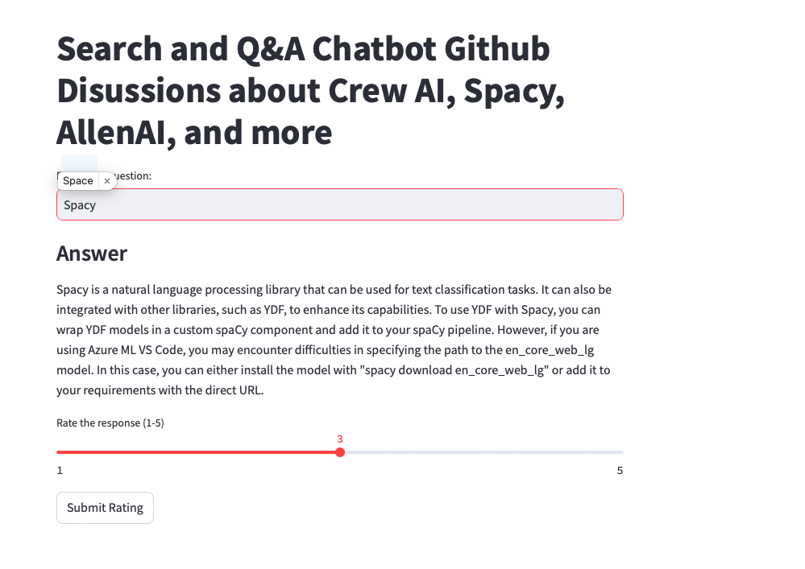
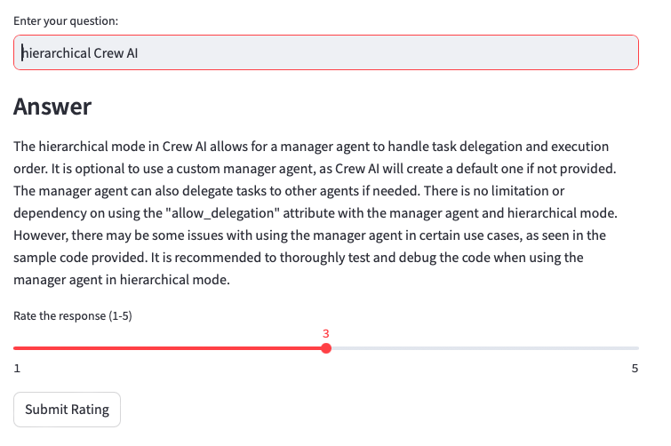
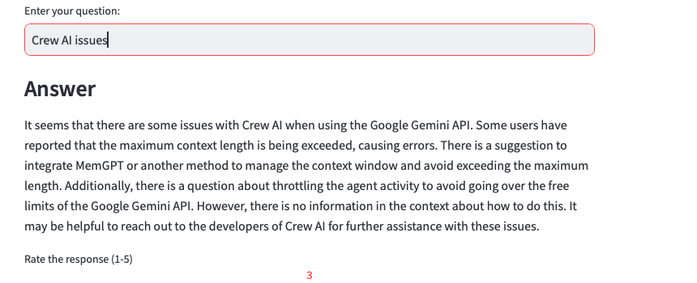

# RAG Q&A System with GitHub Discussions

## Project Overview

This project implements a Retrieval-Augmented Generation (RAG) Q&A system using GitHub Discussions as the knowledge base. RAG combines the power of large language models with a retrieval system to generate more accurate and contextually relevant answers.

## Table of Contents

1. [Project Scope](#project-scope)
2. [Architecture and Technology Stack](#architecture-and-technology-stack)
3. [Installation](#installation)
4. [Configuration](#configuration)
5. [Usage](#usage)
6. [Running the RAG Q&A System](#running-the-rag-qa-system)
7. [Monitoring](#monitoring)
8. [Retrieval Evaluation](#retrieval-evaluation)
9. [RAG Evaluation](#rag-evaluation)

## Project Scope

This project aims to create a RAG Q&A system that:

1. Ingests GitHub Discussions data into a Typesense database using Mage AI for data orchestration.
2. Implements a RAG flow to query the knowledge base and generate answers using an LLM.
3. Monitors the system's performance and user interactions using Grafana.
4. Stores metadata and logs in a PostgreSQL database.

## Architecture and Technology Stack

Our RAG Q&A system is built on a modular architecture that leverages several key technologies:

1. **Data Ingestion and Processing**
   - **Mage AI**: An open-source data pipeline tool used for ingesting and processing GitHub Discussions data. It handles the extraction of discussions, preprocessing of text, and generation of embeddings.

2. **Vector Database**
   - **Typesense**: A fast, typo-tolerant search engine used as our vector database. It stores the processed discussion data and their corresponding embeddings, allowing for efficient similarity searches during the retrieval phase.

3. **RAG Implementation**
   - **Python**: The core RAG logic is implemented in Python, using libraries such as `langchain` for the retrieval process and integration with language models.
   - **OpenAI API**: Used for generating embeddings and powering the language model for answer generation.

4. **User Interface**
   - **Streamlit**: Provides a simple, interactive web interface for users to input questions and receive answers.

5. **Monitoring and Logging**
   - **Grafana**: An open-source analytics and monitoring platform. It's used to visualize system performance metrics, user interaction statistics, and other relevant data.
   - **PostgreSQL**: A powerful, open-source relational database used for storing metadata, logs, and performance metrics.

6. **Containerization and Orchestration**
   - **Docker**: Used for containerizing individual components of the system, ensuring consistency across different environments.
   - **Docker Compose**: Orchestrates the multi-container application, managing the interactions between different services.

### System Flow

1. GitHub Discussions data is ingested and processed by Mage AI pipelines.
2. Processed data and embeddings are stored in Typesense.
3. When a user asks a question, the system retrieves relevant documents from Typesense.
4. Retrieved documents are combined with the user's question and sent to the language model.
5. The language model generates an answer based on the retrieved context and the question.
6. The answer is presented to the user through the Streamlit interface.
7. Throughout this process, logs and metrics are stored in PostgreSQL and visualized in Grafana.

This architecture ensures scalability, maintainability, and efficient performance of the RAG Q&A system.

## Installation

### Prerequisites

- Docker and Docker Compose
- Git

### Setup

1. Clone the repository:
   ```bash
   git clone https://github.com/yourusername/rag-qa-system.git
   cd rag-qa-system
   ```

2. Create a `.env` file in each service folder (see [Configuration](#configuration) section).

3. Build and start the containers for each service:
   ```bash
   cd mage-ai && docker-compose up -d
   cd ../typesense && docker-compose up -d
   cd ../grafana && docker-compose up -d
   cd ../postgres && docker-compose up -d
   ```

This will start the following services:
- Mage AI: http://localhost:6789
- Typesense: http://localhost:8108
- Grafana: http://localhost:3000
- PostgreSQL: localhost:5432 (backend no interface)

## Configuration

Create a `.env` file in the project root with the following content:

```
OPENAI_API_KEY=your_openai_api_key
TYPESENSE_API_KEY=your_typesense_api_key
POSTGRES_DB=rag_qa_db
POSTGRES_USER=rag_qa_user
POSTGRES_PASSWORD=your_secure_password
POSTGRES_HOST=postgres
POSTGRES_PORT=5432
GITHUB_TOKEN=your_github_personal_access_token
```

Replace the placeholder values with your actual API keys and credentials.

## Usage

1. Access the Mage AI interface at http://localhost:6789 to set up and run the data ingestion pipeline.



2. Once the data is ingested, you can use the provided Python scripts to query the RAG system.

3. Monitor the system's performance and user interactions through Grafana at http://localhost:3000.



## Running the RAG Q&A System

The main component of this project is the `rag_flow.py` script, which starts a Streamlit app allowing users to interact with the RAG Q&A system.

To run the Streamlit app:

1. Ensure all services are running (Mage AI, Typesense, PostgreSQL, and Grafana).

2. Navigate to the project directory:
   ```bash
   cd rag-qa-system
   ```

3. Install the required Python packages if you haven't already:
   ```bash
   pip install -r requirements.txt
   ```

4. Run the Streamlit app:
   ```bash
   streamlit run rag_flow.py
   ```

5. Open your web browser and go to `http://localhost:8501` to access the RAG Q&A interface.

### Using the RAG Q&A Interface

1. Enter your question in the text input field.
2. Click the "Ask" button or press Enter to submit your question.
3. The system will process your question, retrieve relevant information from the GitHub Discussions, and generate an answer.
4. The answer will be displayed along with relevant source information.





You can ask multiple questions and the chat history will be displayed in the interface.

### Performance and Monitoring

As you use the RAG Q&A system, performance metrics and user interactions are logged and can be monitored through the Grafana dashboard.

## Monitoring

Access Grafana at http://localhost:3000 to view dashboards for:
- User interaction statistics

Custom dashboards can be created to track specific metrics.

For more detailed information on each component, refer to their respective documentation:
- [Mage AI Documentation](https://docs.mage.ai/)
- [Typesense Documentation](https://typesense.org/docs/)
- [Grafana Documentation](https://grafana.com/docs/)
- [PostgreSQL Documentation](https://www.postgresql.org/docs/)

## Retrieval Evaluation
Retrieval evaluations are crucial for the retriever component of a RAG system, which typically utilizes a vector database. These evaluations measure the effectiveness of the retriever in identifying and ranking relevant documents in response to a user query. The primary goal is to assess context relevance—ensuring that the retrieved documents align well with the user's query. This guarantees that the context provided to the generation component is both pertinent and accurate.

### Context

Each of the metrics offers a unique perspective on the quality of the retrieved documents and contributes to a comprehensive understanding of context relevance.

### Precision

Precision measures the accuracy of the retrieved documents. It is the ratio of the number of relevant documents retrieved to the total number of documents retrieved. It's defined as:

Precision = (Number of Relevant Documents Retrieved) / (Total Number of Documents Retrieved)

This means that precision evaluates how many of the documents retrieved by the system are actually relevant to the user's query. For example, if the retriever retrieves 10 documents and 7 of them are relevant, the precision would be 0.7 or 70%.

Precision evaluates, "Out of all the documents that the system retrieved, how many were actually relevant to the user's query from the GitHub Discussions?"

### Recall

Recall measures the comprehensiveness of the retrieved documents. It is the ratio of the number of relevant documents retrieved to the total number of relevant documents in the database for the given query. It's defined as:

Recall = (Number of Relevant Documents Retrieved) / (Total Number of Relevant Documents in the Database)

This means that recall evaluates how many of the relevant documents that exist in the database were successfully retrieved by the system.

Recall evaluates: "Out of all the relevant documents that exist in the database, how many did the system manage to retrieve?" In the context of GitHub Discussions, this means assessing how many of the relevant discussions related to the user's query were successfully retrieved by the system.

### Balance Between Precision and Recall

Balancing precision and recall is often necessary, as improving one can sometimes reduce the other. The goal is to find an optimal balance that suits the specific needs of the application. This balance is sometimes quantified using the F1 score, which is the harmonic mean of precision and recall:

F1 Score = 2 (Precision Recall) / (Precision + Recall)

### Evaluation Process

To ensure the most effective retrieval methods are used, we will:

1. **Evaluate Multiple Retrieval Approaches**: Test various retrieval methods to determine which one provides the most relevant and accurate results.
2. **Select the Best Approach**: Based on the evaluation, select the most effective retrieval approach to be used in the system.
3. **Continuous Optimization**: Continuously monitor the performance of the selected retrieval method and make necessary adjustments to maintain optimal performance.

By performing these evaluations, we aim to enhance the accuracy and reliability of the answers generated by the RAG Q&A system, ensuring that users receive the most relevant information from the GitHub Discussions knowledge base.

## RAG Evaluation
For the sake of simplicity and for testing purposes, we evaluate two sample approaches to RAG. The project evaluates multiple RAG approaches to select the best one based on precision, recall, and F1 score. The following RAG approaches are currently implemented:

- **RAG Approach 1**: Uses Typesense search with `num_typos=2`.
- **RAG Approach 2**: Uses Typesense search with `num_typos=1`.

The best RAG approach is automatically selected and used for generating responses.


## User Query Rewriting

To improve the quality of the answers generated by the RAG system, we implement a user query rewriting feature. This feature refines the user's query to make it more effective for retrieval and generation processes.

### How It Works

1. **Initial Query**: The user submits a query through the Streamlit interface.
2. **Query Rewriting**: The system processes the initial query to rewrite it for better clarity and context.
3. **Retrieval and Generation**: The rewritten query is used to retrieve relevant documents and generate an answer.
4. **Final Answer**: The answer is presented to the user along with the rewritten query for transparency.

### Example

- **User Query**: "How to use Crew AI?"
- **Rewritten Query**: "What are the key features and steps to implement Crew AI for task management and coordination in AI systems, as discussed in recent GitHub threads?"


